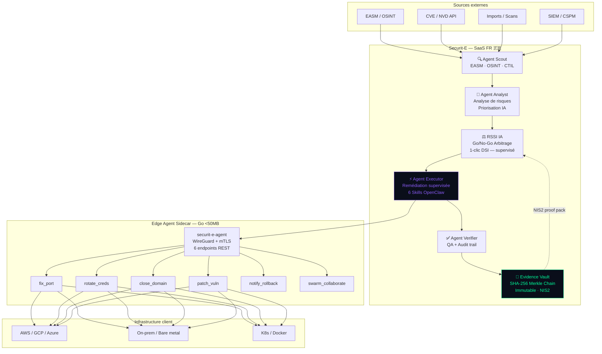
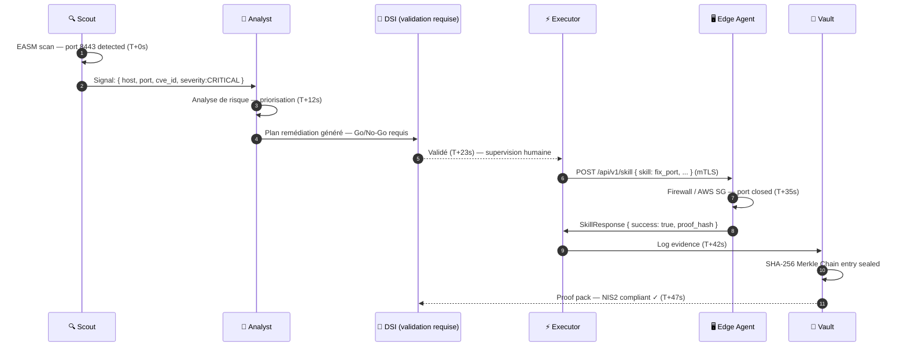
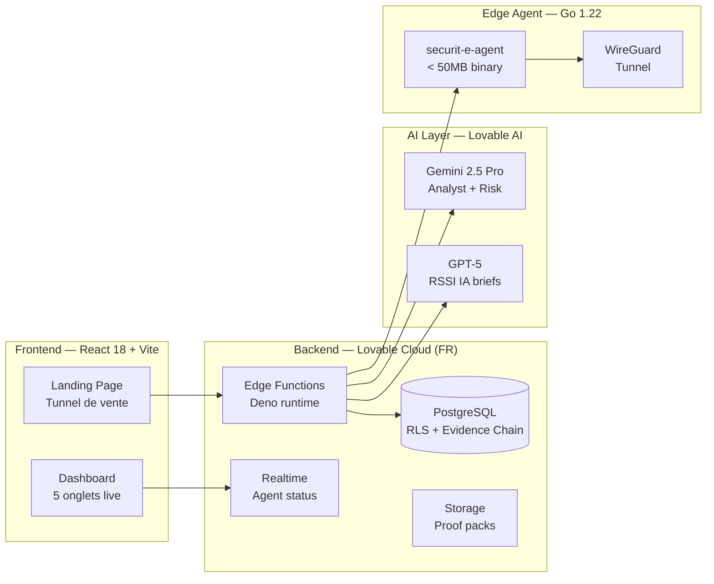

# SECURIT-E — Plateforme de Gouvernance Cyber Assistée par IA

> **SECURIT-E — Centre de commandement cyber assisté par IA pour dirigeants et DSI exigeants.**
> **6 agents détectent, analysent et proposent des remédiations avec supervision humaine. Preuves SHA-256 Merkle Chain immuables. Souverain France.**

[](https://securit-e.com)
[](https://securit-e.com)
[](https://securit-e.com)
[](https://securit-e.com)

---

## 🛡 Qu'est-ce que Securit-E ?

**Securit-E** est une **plateforme de gouvernance cyber assistée par IA** souveraine française. 6 agents IA collaborent pour détecter, analyser et orchestrer des remédiations supervisées — avec une preuve cryptographique SHA-256 Merkle Chain à chaque étape.

### Le cycle de 47 secondes (mesuré en conditions de laboratoire contrôlées)

```
T+0s    Scout détecte un port 8443 exposé (EASM scan)
T+12s   Analyst corrèle avec CVE-2025-1337, génère plan de remédiation
T+23s   DSI valide en 1 clic (Go/No-Go) — validation humaine requise
T+35s   Executor ferme le port via playbook supervisé (AWS SG / nftables)
T+47s   Vault signe la preuve SHA-256 Merkle Chain → NIS2 ✓
```

> **Note de transparence** : ce cycle est une démonstration de laboratoire sur périmètre contrôlé. En production, les délais réels dépendent de votre infrastructure, des validations humaines requises et de la complexité de l'incident.

---

## 🏗 Architecture

### Diagramme principal



### Séquence de remédiation supervisée



### Stack technique



---

## 💰 Pricing

| Plan | Prix | Capacités | Cible |
|------|------|-----------|-------|
| **Sentinel** | 490 €/an | Détection OSINT · Scout Agent · Alertes · NIS2 docs | ETI 50-200 pers. |
| **Command** ⭐ | 6 900 €/an | 6 Agents IA supervisés · Remédiation assistée · OSINT/EASM · Evidence Vault SHA-256 | ETI/Grands comptes |
| **Sovereign** | 29 900 €/an | On-prem · Souveraineté totale · Account Manager | OIV / CAC40 |

---

## 🚀 Installation rapide (Client)

### Option 1 — SaaS (recommandé)

```bash
# 1. Créer un compte sur securit-e.com
# 2. Télécharger l'Edge Agent sidecar (disponible sur demande)

export SECURITE_TENANT_ID="votre-tenant-id"
export SECURITE_REGION="fr-paris"
./securit-e-agent
```

### Option 2 — Docker

```bash
docker run -d \
  --name securit-e-agent \
  -e SECURITE_TENANT_ID=votre-tenant-id \
  -e SECURITE_REGION=fr-paris \
  -v ./certs:/certs:ro \
  -p 8443:8443 \
  securit-e/edge-agent:2026.1.0
```

### Option 3 — Kubernetes (Helm)

```bash
helm repo add securit-e https://charts.securit-e.com
helm repo update

helm install securit-e-agent securit-e/edge-agent \
  --namespace securit-e-system --create-namespace \
  --set securite.tenantId="votre-tenant-id" \
  --set securite.region="fr-paris" \
  --set tls.existingSecret="securit-e-mtls-certs"
```

---

## 🔬 Skills OpenClaw (6 skills — orchestration supervisée)

| Skill | Description | Mode |
|-------|-------------|------|
| `fix_port` | Ferme un port exposé | Supervisé / Go-No-Go |
| `rotate_creds` | Rotation credentials | Supervisé / Go-No-Go |
| `close_domain` | Neutralise un domaine malveillant | Supervisé / Go-No-Go |
| `patch_vuln` | Patch CVE | Supervisé / Go-No-Go |
| `notify_rollback` | Alerte + rollback | Automatique |
| `swarm_collaborate` | Partage intel inter-clients | Anonymisé |

---

## 📅 Roadmap

### Q1 2026
- [ ] Certification ANSSI / CSPN — démarches en cours
- [ ] Intégration Microsoft Sentinel / Splunk
- [ ] SecNumCloud — objectif roadmap (non obtenu à ce jour)

### Q2 2026
- [ ] Enterprise on-prem (air-gapped)
- [ ] SOC-as-a-Service add-on

---

## 🛡 Sécurité & Souveraineté

- **Hébergement :** Cloud FR souverain — données en France 🇫🇷
- **Cryptographie :** SHA-256 Merkle Chain pour la chaîne de preuves (Evidence Vault)
- **Conformité :** NIS2 · RGPD · DORA · ISO 27001
- **Audit :** Chaque action prouvée par la chaîne SHA-256, non répudiable
- **SecNumCloud :** objectif roadmap Q2 2026 — certification non obtenue à ce jour

---

## 📄 Licence

Propriétaire — © 2026 Securit-E SAS. Tous droits réservés.

---

*Securit-E — Gouvernance cyber assistée par IA pour les dirigeants exigeants. 🛡️*
