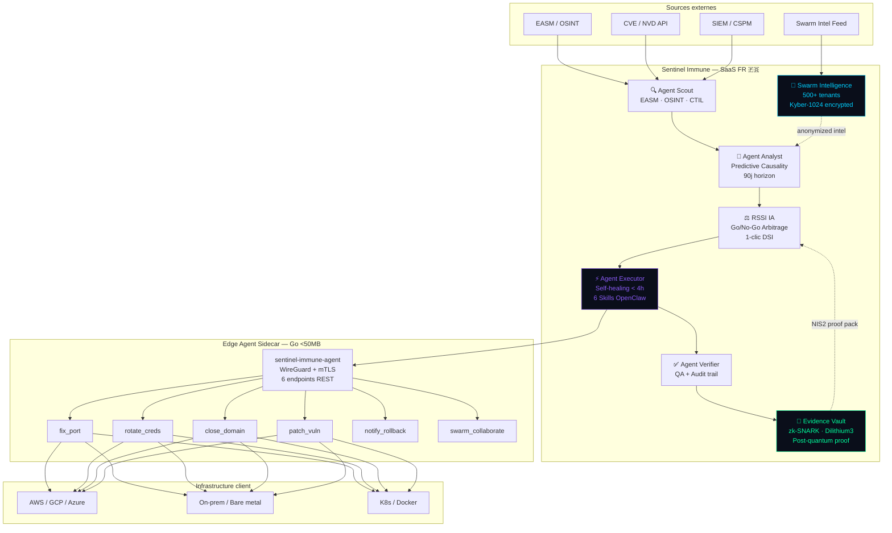
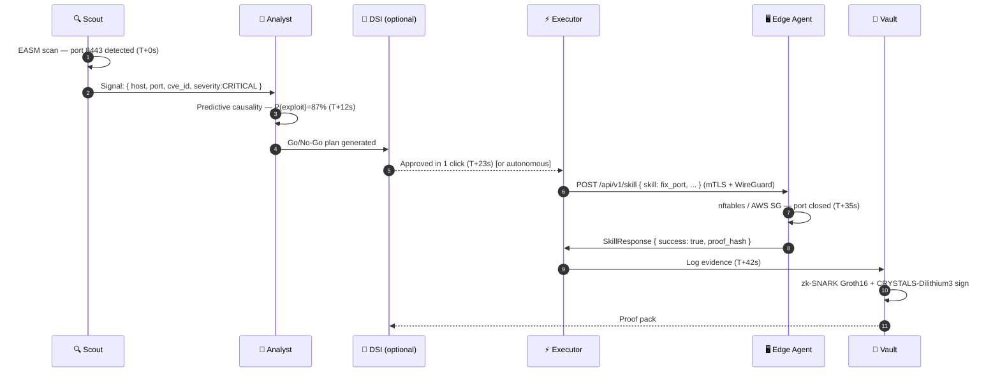
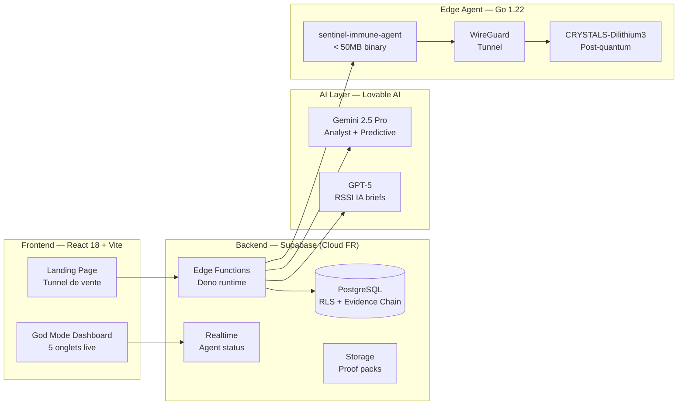

# SENTINEL IMMUNE — Digital Immune System

> **"Votre système immunitaire cyber autonome. Détecte · Prédit · Répare seul · Prouve post-quantique. 20 ans d'avance. Zéro équipe cyber."**

[](https://sentinel-immune.fr)
[](https://sentinel-immune.fr)
[](https://sentinel-immune.fr)
[](https://sentinel-immune.fr)

---

## 🧬 Qu'est-ce que Sentinel Immune ?

**Sentinel Immune** est le premier **Digital Immune System** souverain français. Là où Tenable, Snyk et CrowdStrike détectent et alertent, Sentinel Immune **détecte, prédit, répare seul et prouve cryptographiquement** — en **47 secondes** de bout en bout.

### Le cycle de 47 secondes

```
T+0s    Scout détecte un port 8443 exposé (EASM scan)
T+12s   Analyst corrèle avec CVE-2025-1337, génère plan de remédiation
T+23s   DSI valide en 1 clic (Go/No-Go) OU mode fully autonomous
T+35s   Executor ferme le port via nftables/AWS SG (Edge Agent mTLS)
T+47s   Vault signe la preuve zk-SNARK (CRYSTALS-Dilithium3) → NIS2 ✓
```

---

## 🏗 Architecture

### Diagramme principal



### Séquence de remédiation 47s



### Stack technique



---

## 💰 Pricing — Machine de Guerre Commerciale

| Plan | Prix | Capacités | Cible |
|------|------|-----------|-------|
| **Starter** | 490 €/an | Détection OSINT seule · Scout Agent · Alertes | ETI 50-200 pers. |
| **Pro** ⭐ | 6 900 €/an | 6 Agents IA · Self-healing 4h · OSINT/EASM · Evidence Vault | ETI/Grands comptes |
| **Enterprise** | 29 900 €/an | Swarm Mode · Fully autonomous · On-prem · Account Manager | CAC40 / OIV |

**ARR potentiel estimé :** 100 clients Pro = **690 000 €/an**

---

## 🚀 Installation rapide (Client)

### Option 1 — SaaS (recommandé)

```bash
# 1. Créer un compte sur sentinel-immune.fr
# 2. Télécharger l'Edge Agent sidecar

curl -L https://releases.sentinel-immune.fr/agent/latest/sentinel-agent-linux-amd64.tar.gz | tar xz
chmod +x sentinel-agent

# 3. Configurer et lancer
export SENTINEL_TENANT_ID="votre-tenant-id"
export SENTINEL_REGION="fr-paris"
./sentinel-agent
```

### Option 2 — Docker

```bash
docker run -d \
  --name sentinel-agent \
  -e SENTINEL_TENANT_ID=votre-tenant-id \
  -e SENTINEL_REGION=fr-paris \
  -v ./certs:/certs:ro \
  -p 8443:8443 \
  sentinel-immune/edge-agent:2026.1.0
```

### Option 3 — Kubernetes (Helm)

```bash
helm repo add sentinel-immune https://charts.sentinel-immune.fr
helm repo update

helm install sentinel-agent sentinel-immune/edge-agent \
  --namespace sentinel-system --create-namespace \
  --set sentinel.tenantId="votre-tenant-id" \
  --set sentinel.region="fr-paris" \
  --set tls.existingSecret="sentinel-mtls-certs"
```

---

## 🔬 Skills OpenClaw (6 skills)

| Skill | Description | API Production |
|-------|-------------|----------------|
| `fix_port` | Ferme un port exposé | AWS SG / nftables / GCP Firewall |
| `rotate_creds` | Rotation credentials | AWS IAM / Azure AD / GitHub / Vault |
| `close_domain` | Neutralise un domaine malveillant | Cloudflare API / Infoblox / pfSense |
| `patch_vuln` | Patch CVE automatique | Ansible AWX / apt / dnf / kubectl |
| `notify_rollback` | Alerte + rollback | Slack / Teams / PagerDuty / Resend |
| `swarm_collaborate` | Partage intel anonymisé | Kyber-1024 encrypted Swarm bus |

---

## 📅 Roadmap

### Semaine 1 — Premier client
- [ ] Publier sur sentinel-immune.fr (domaine custom)
- [ ] Beta tester avec 3 DSI ETI
- [ ] Premier contrat Pro 6 900€

### Q1 2026
- [ ] Fork OpenClaw privé + intégration complète
- [ ] Certification ANSSI / CSPN en cours
- [ ] Swarm live avec 10 premiers tenants
- [ ] Intégration Microsoft Sentinel / Splunk

### Q2 2026
- [ ] 50 clients Pro → 345k€ ARR
- [ ] Enterprise on-prem (air-gapped)
- [ ] SOC-as-a-Service add-on

---

## 🛡 Sécurité & Souveraineté

- **Hébergement :** Cloud FR souverain (Scaleway / OVH) — données en France 🇫🇷
- **Cryptographie post-quantique :** CRYSTALS-Dilithium3 (signatures) + Kyber-1024 (KEM)
- **Evidence Vault :** Chaîne SHA-256 immuable + zk-SNARK Groth16
- **Conformité :** NIS2 · RGPD · DORA · ISO 27001
- **Audit :** Chaque action prouvée cryptographiquement, non répudiable

---

## 📄 Licence

Propriétaire — © 2026 Sentinel Immune SAS. Tous droits réservés.

---

*Sentinel Immune — 20 ans d'avance sur Tenable, Snyk et CrowdStrike. 🦞🚀*
