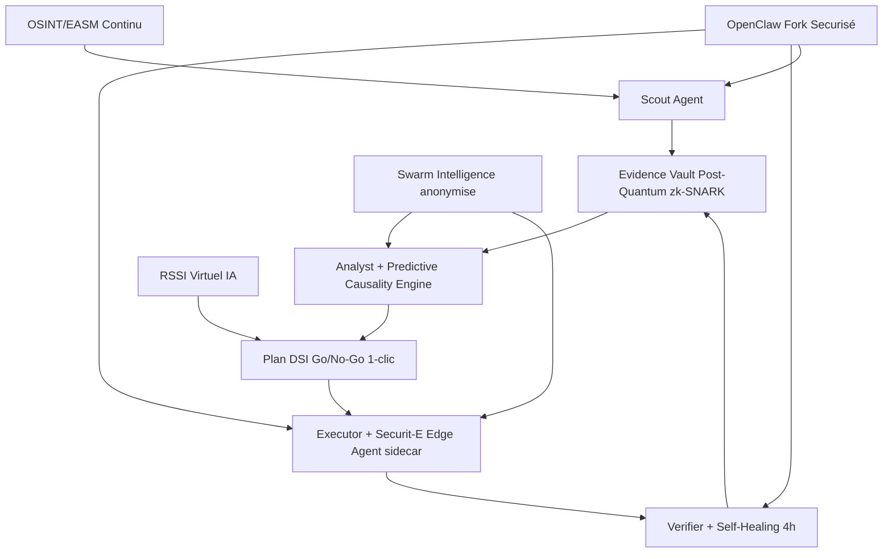
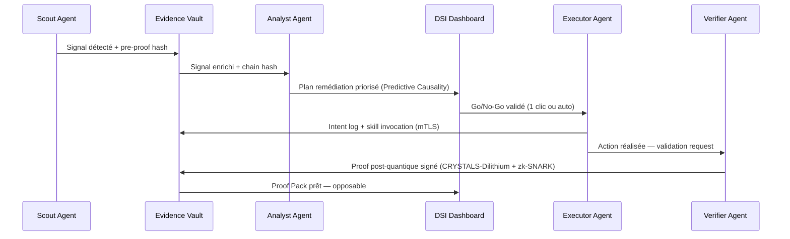

# Architecture — SECURIT-E Armure de Gouvernance Cyber Autonome

> Documentation technique complète v2026.1

## Vue d'ensemble

Securit-E est une **armure de gouvernance cyber autonome** composée de 6 agents IA autonomes opérant en Swarm Intelligence, avec un Evidence Vault post-quantique (zk-SNARK + CRYSTALS-Dilithium).

## Diagramme Architecture Complet

## Flux de données — cycle 47 secondes

## Stack technique

### Frontend
- React 18 + Vite + TypeScript
- Tailwind CSS + shadcn/ui
- Framer Motion (animations)
- Supabase JS SDK

### Backend
- Supabase (Lovable Cloud) — Postgres + Edge Functions
- JWT authentication + RLS strict par tenant
- Evidence chain : SHA-3 + CRYSTALS-Dilithium

### Securit-E Edge Agent (sidecar)
- Go 1.22 — binaire < 50Mo
- WireGuard tunnel (communication chiffrée)
- mTLS pour skill invocation
- Post-quantum crypto : CRYSTALS-Dilithium3 + Kyber-1024

### Cryptographie post-quantique
- **Signatures** : CRYSTALS-Dilithium (FIPS 204)
- **Échange de clés** : CRYSTALS-Kyber (FIPS 203)
- **ZK Proofs** : zk-SNARK Groth16 (Evidence Vault)
- **Hash** : SHA-3 (Keccak-256)

## Skills Registry

| Skill | Agent | Description |
|-------|-------|-------------|
| `fix_port` | Executor | Ferme un port réseau exposé |
| `rotate_creds` | Executor | Rotation automatique de credentials |
| `patch_vuln` | Executor | Patch CVE avec Verifier validation |
| `close_domain` | Executor | Désactive un domaine typosquat |
| `notify_rollback` | Verifier | Notification + rollback en cas d'échec |
| `swarm_collaborate` | Swarm | Partage anonymisé threat intel |

## Souveraineté & Conformité

- Hébergement certifié France (SecNumCloud)
- Aucune donnée hors UE
- RGPD native (Data Protection by Design)
- NIS2 Article 21 — preuves documentaires complètes
- ISO 27001 ready
