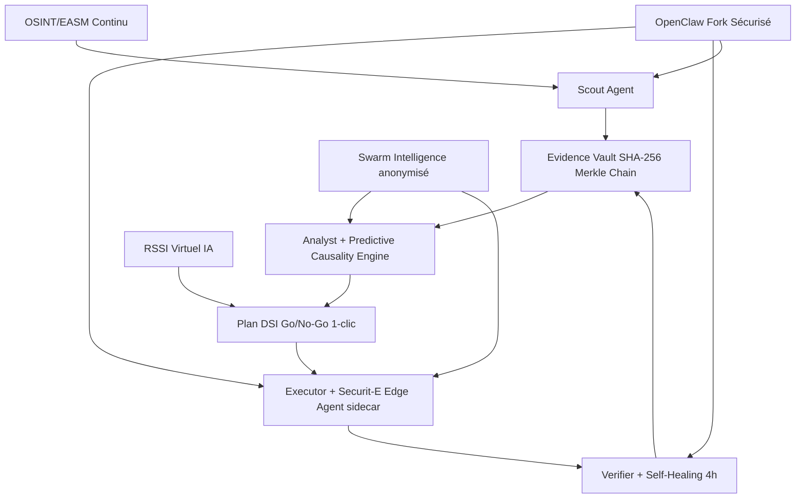
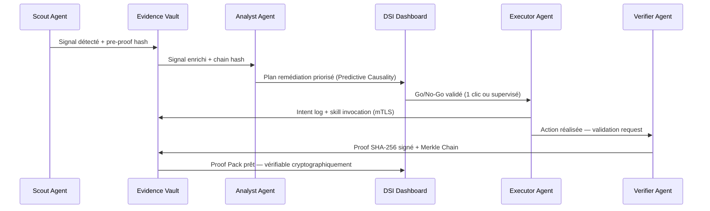

# Architecture — SECURIT-E Armure de Gouvernance Cyber

> Documentation technique complète v2026.1

## Vue d'ensemble

Securit-E est une **armure de gouvernance cyber supervisée** composée de 6 agents IA opérant en délégation assistée, avec un Evidence Vault cryptographique (SHA-256 Merkle Chain).

## Diagramme Architecture Complet

## Flux de données — cycle 47 secondes (mesuré en conditions de laboratoire contrôlées)

## Stack technique

### Frontend
- React 18 + Vite + TypeScript
- Tailwind CSS + shadcn/ui
- Framer Motion (animations)
- Supabase JS SDK

### Backend
- Supabase (Lovable Cloud) — Postgres + Edge Functions
- JWT authentication + RLS strict par tenant
- Evidence chain : SHA-256 Merkle Chain (implémenté et vérifié)

### Securit-E Edge Agent (sidecar)
- Go 1.22 — binaire < 50Mo
- WireGuard tunnel (communication chiffrée)
- mTLS pour skill invocation
- Transport chiffré AES-256-GCM

### Cryptographie implémentée
- **Hash & Merkle Chain** : SHA-256 (implémenté — `compute_evidence_hash_chain` trigger)
- **Signatures JWT** : HS256/RS256 via Supabase Auth
- **Transport** : TLS 1.3 + WireGuard (Edge Agent)

### Cryptographie roadmap (non implémentée à ce stade)
- Algorithmes post-quantiques : objectif 2027 (NIST FIPS 203/204)
- ZK Proofs : étude de faisabilité en cours

## Skills Registry

| Skill | Agent | Description |
|-------|-------|-------------|
| `fix_port` | Executor | Ferme un port réseau exposé |
| `rotate_creds` | Executor | Rotation automatique de credentials |
| `patch_vuln` | Executor | Patch CVE avec Verifier validation |
| `close_domain` | Executor | Désactive un domaine typosquat |
| `notify_rollback` | Verifier | Notification + rollback en cas d'échec |
| `swarm_collaborate` | Swarm | Partage anonymisé threat intel |

## Souveraineté & Conformité

- Hébergement en France (SecNumCloud : objectif roadmap 2026)
- Aucune donnée hors UE
- RGPD native (Data Protection by Design)
- NIS2 Article 21 — preuves documentaires complètes
- ISO 27001 ready
