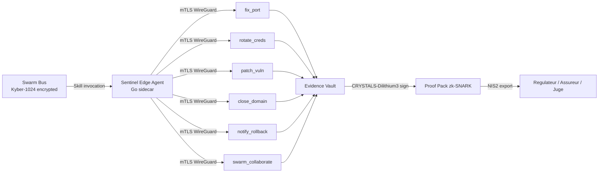
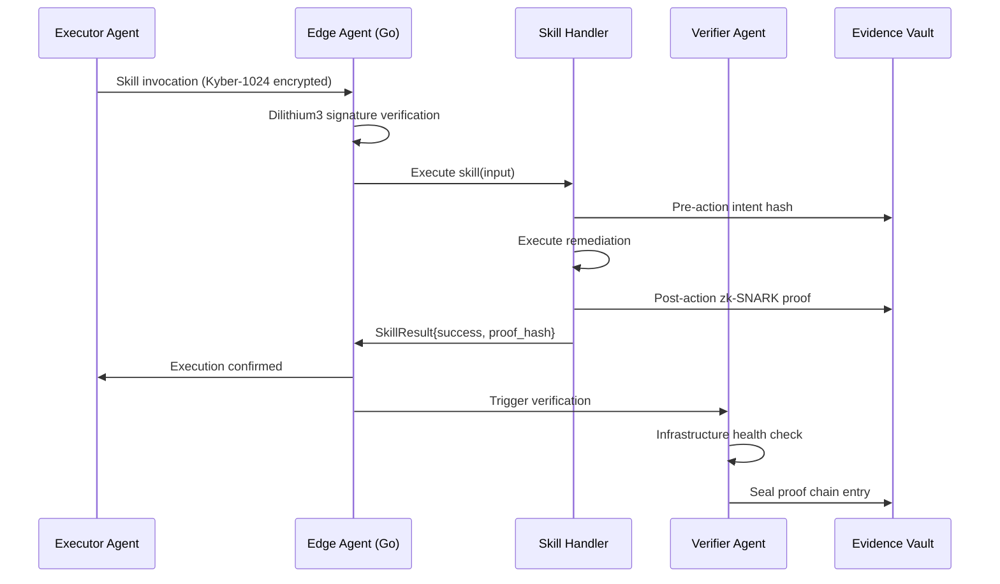

# Securit-E Edge Agent

> Sidecar Go ultra-léger &lt;50Mo — WireGuard + mTLS + post-quantum crypto (CRYSTALS-Dilithium3)
> 
> Pilote les 6 skills OpenClaw (fix_port, rotate_creds, close_domain, patch_vuln, notify_rollback, swarm_collaborate)

## Démarrage rapide

```bash
export SENTINEL_TENANT_ID=your-org-id
go build -o securit-e-agent ./cmd/agent
./securit-e-agent --config config.yaml
```

## Structure

```
sentinel-immune-agent/
├── cmd/agent/main.go              # Point d'entrée — WireGuard + mTLS + skill dispatch
├── internal/
│   ├── wireguard/tunnel.go        # Tunnel chiffré WireGuard
│   ├── mtls/client.go             # Client mTLS bidirectionnel
│   ├── skills/
│   │   ├── fix_port.go            # Fermer port réseau exposé
│   │   ├── rotate_creds.go        # Rotation credentials multi-service
│   │   ├── close_domain.go        # Neutraliser domaine malveillant
│   │   ├── patch_vuln.go          # Patcher CVE automatiquement
│   │   ├── notify_rollback.go     # Notifier + rollback en cas d'échec
│   │   └── swarm_collaborate.go   # Intelligence anonymisée inter-clients
│   ├── crypto/dilithium.go        # CRYSTALS-Dilithium3 signing
│   └── vault/local_cache.go       # Cache local Evidence Vault
├── config.example.yaml
└── README.md
```

## Architecture Swarm



## Cycle complet (47 secondes)



## Configuration (config.example.yaml)

```yaml
tenant_id: "your-org-uuid"
region: "fr-paris"

agent:
  public_key: "YOUR_WIREGUARD_PUBLIC_KEY"
  endpoint: "immune.sentinel-edge.fr:51820"
  skills_enabled:
    - fix_port
    - rotate_creds
    - close_domain
    - patch_vuln
    - notify_rollback
    - swarm_collaborate

crypto:
  algorithm: "CRYSTALS-Dilithium3"
  zk_backend: "groth16"
  post_quantum: true

self_healing:
  max_auto_remediation: 5
  require_dsi_approval: true    # false = fully autonomous mode
  rollback_timeout_hours: 4
```

## Build & Deploy

```bash
# Build binaire statique Linux
CGO_ENABLED=0 GOOS=linux GOARCH=amd64 go build \
  -ldflags="-w -s" \
  -o sentinel-edge-agent \
  ./cmd/agent

# Vérifier taille < 50Mo
ls -lh sentinel-edge-agent

# Docker (production)
docker build -t sentinel-immune/edge-agent:latest .
docker run -d \
  -e SENTINEL_TENANT_ID=your-org-id \
  -v /etc/sentinel/config.yaml:/app/config.yaml:ro \
  sentinel-immune/edge-agent:latest
```

## Sécurité

- **WireGuard** : tunnel chiffré Curve25519 pour tout le trafic agent
- **mTLS** : authentification mutuelle TLS 1.3 entre agent et platform
- **CRYSTALS-Dilithium3** : signature post-quantique NIST standardisée sur chaque skill call
- **Kyber-1024** : échange de clés post-quantique sur le Swarm Bus
- **zk-SNARK Groth16** : preuve à divulgation nulle de chaque action de remédiation
- Rollback automatique si vérification échoue (timeout 4h)
- Aucune clé privée ne quitte l'agent (principe Zero-Knowledge)

## Skills disponibles

| Skill | Agent | Description |
|-------|-------|-------------|
| `fix_port` | Executor | Ferme un port réseau exposé via firewall rules |
| `rotate_creds` | Executor | Rotation AWS IAM, GitHub tokens, passwords DB |
| `close_domain` | Executor | Sinkhole/block domaine typosquat ou C2 |
| `patch_vuln` | Executor | Apply OS/application patch pour CVE ciblé |
| `notify_rollback` | Verifier | Rollback + notification stakeholders sur échec |
| `swarm_collaborate` | Swarm | Partage anonymisé de TTP avec le Swarm inter-clients |

---

*Sentinel Immune Edge Agent — Souveraineté Numérique France 🇫🇷 — Post-Quantum Ready*
