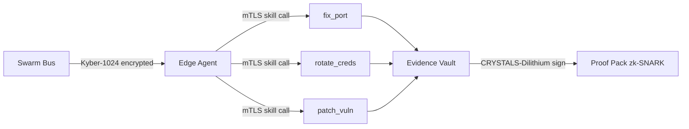

# Sentinel Immune Edge Agent

> Sidecar Go ultra-léger < 50Mo — WireGuard + mTLS + post-quantum crypto

## Démarrage rapide

```bash
go build -o sentinel-edge-agent ./cmd/agent
./sentinel-edge-agent --config config.yaml
```

## Structure

```
sentinel-immune-agent/
├── cmd/agent/main.go
├── internal/
│   ├── wireguard/tunnel.go
│   ├── mtls/client.go
│   ├── skills/
│   │   ├── fix_port.go
│   │   ├── rotate_creds.go
│   │   ├── patch_vuln.go
│   │   ├── close_domain.go
│   │   ├── notify_rollback.go
│   │   └── swarm_collaborate.go
│   ├── crypto/dilithium.go
│   └── vault/local_cache.go
└── config.example.yaml
```

## Architecture Agents


